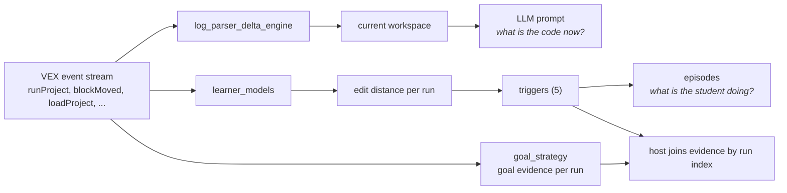

# agent-lm-packages

Three small, **pure** Python packages that turn a VEX (VEXcode VR) student's block event
stream into things an agent can act on: the current workspace, behavioral triggers, and
goal evidence with explicit uncertainty. No database, no web framework. Each package takes plain
data in and returns plain data back, so any host (reflecks, the agent server, a notebook)
can drive them.

Each folder has its own README. Install all three with `pip install .` from the repo root.

## The three packages

| Folder | What it does | Deps | Status |
|---|---|---|---|
| [`log_parser_delta_engine/`](log_parser_delta_engine/) | Replay a log stream (or one project XML) into the current VEX workspace and render it as pseudo-code (compact + readable). | stdlib | populated |
| [`learner_models/`](learner_models/) | Per-run edit distances (APTED), the 5 behavioral triggers, and session episodes. | `apted` | populated |
| [`goal_strategy/`](goal_strategy/) | Goal profiles, simulation, timelines, sensor battery and optional review tools. | `pyyaml`; analysis/UI extras | populated |

## How they fit together



## Two workspace renderers

Both renderers live in `log_parser_delta_engine`. They render the same VEX workspace as
pseudo-code, for two audiences. The names follow one pattern, `generate_<style>_<form>`,
so which one is needed is readable off the call.

| Renderer | Audience | What it does |
|---|---|---|
| `generate_compact_prompt` (standalone) / `smart_delta_engine.generate_compact_prompt()` (method) | LLM | Token-cheap listing split into `[Active]` (reachable from a hat block) and `[Orphaned]`. Strips noisy `pg_`/`aim_`/`mixed_` prefixes. No name lookup. Value-slot literals (drive distance, turn degrees) folded into parent fields. |
| `generate_readable_text` / `generate_readable_lines` | Human | Full display names from `vex_blocks.json`, infix operators (`A < B`), tidied enums (`fwd` to `forward`), inline reporter values, `else:` branch labels. No active/orphan split. |

Each renderer also has a `_from_content` variant that takes a parsed VEX log content dict
and extracts the workspace XML internally (e.g. `generate_compact_prompt_from_content`).

Use **compact** when building an LLM prompt (spend tokens on structure, not prose). Use
**readable** when showing the code to a person.

## Data contract (what you feed in)

The integration APIs read the same parsed VEX log event, a dict with three keys:

```python
{"event_type": "runProject",        # str,   the VEX eventType
 "content": {...parsed VEX log...}, # dict,  carries project.workspace + playground
 "ts": 1690000000.0}                # float, epoch seconds (or None)
```

Each function reads only what it needs:

| Function | Reads | Returns |
|---|---|---|
| `compute_run_edit_distances(events)` | `runProject` events, their `content` (`project.workspace`, `playground`) and `ts` | `{"runs": [{"index", "edit_distance", "ts", "playground"}]}` |
| `detect_run_triggers_by_playground(runs)` | the `runs` list above | `[(trigger_type, run_index, detail)]` |
| `segment_session(events)` | every event's `event_type` + `ts` (ignores `content`) | `(episodes, pauses)` |
| `generate_compact_prompt(xml_string)` | one workspace XML string | pseudo-code `str`, or `None` if empty |
| `generate_compact_prompt_from_content(content)` | parsed VEX log content dict | pseudo-code `str`, or `None` if empty |

The host supplies these (an adapter from wherever events are stored). Nothing in here
touches a DB. The one stateful trigger, `inactive`, leaves its two DB touch-points to the
caller. See [`learner_models/README.md`](learner_models/README.md).

There's a runnable walkthrough in [`examples/end_to_end.py`](examples/end_to_end.py)
that feeds synthetic event streams through all three packages. Goal evidence does not select feedback or change learner-model triggers.

## Install / test

```bash
pip install .                            # Python 3.10+, all three core packages
python test_smoke.py                     # original 40 sibling-package tests
python examples/end_to_end.py            # narrated walkthrough with real output
```

Install `.[dev]` and run `python -m pytest -q -m "not corpus"` for standalone goal validation. See [goal_strategy/README.md](goal_strategy/README.md) for associated-outcome APIs, optional tools, external data paths, and full-corpus qualification.
