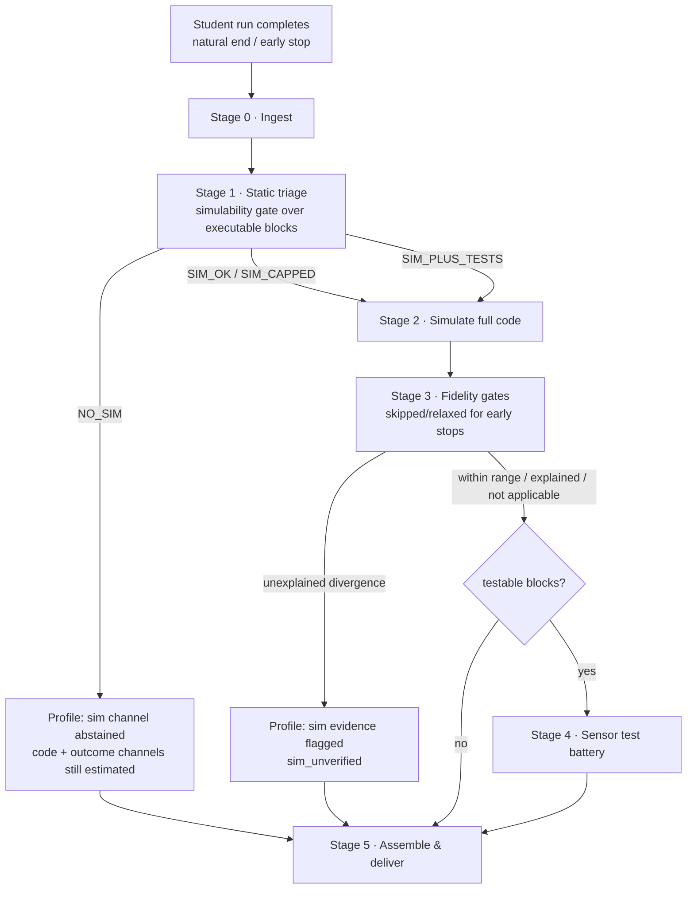

# ONLINE pipeline dataflow — DRAFT for review

Status: sketch (2026-08-19), revised after reviewer rulings; **currency
pass 2026-08-26** — the validation campaign (VALIDATION_PLAN Stages 0-2,
complete) exercised every stage of this sketch offline at population
scale (7,984 runs, zero crashes). Notes marked [2026-08-26] supersede the
original text where the campaign changed the picture. For the
implementer: `src/vex_goal_profiles/dryrun.py`, `fidelity_sweep.py` and
`rung_sweep.py` are working offline analogues of Stages 1-3; `profile()`
is the Stage-5 product; `testcases.py` is Stage 4's harness. **Scope: this is the sketch of what must run ONLINE** — the
lightweight shipped path that fires per student run. A separate, more
developed offline extension (testing, calibration, improvement tooling) is
out of scope here; items that belong to that lane are marked *offline lane*.
Decision points are marked **[D#]**; statuses in the log at the end.

## Stage 0 — Ingest & normalize

Trigger: run-completion event. Payload: workspace XML snapshot **at run
time**, playground output (`playground_params`), run metadata.

- **Stop reason is first-class** in the event schema:
  `completed | stopped_by_user | timeout | error`. Today we infer
  `project_stopped_by_user` out of params; live, it arrives as data.
- **Early stops (ruled, D1): the sim always runs the full code with
  inferences.** We do not truncate to the stop time. The stop reason instead
  changes how downstream stages *interpret* the run:
  - final-XY matching is **not required** (Stage 3 treats the run as
    non-comparable for final position);
  - outcome fields may under-reflect the code (the telemetry describes a
    truncated execution while the estimates describe the full program) —
    outcome-channel evidence carries an uncertainty annotation.
  - Forever-loop programs are *always* early-stopped by construction: same
    estimates as any capped run, uncertainty acknowledged, never penalized.
- Wrong-playground guard: the corpus_filter generalizes to a router — params
  that don't match the declared playground go to a reject/flag lane before
  any simulation.
- **Concurrent `when started` stacks [2026-08-26 — SUPERSEDES the
  creation-order paragraph]:** the most-recently-created lockout was
  falsified and replaced by the VR-Seq cooperative scheduler — a
  transliteration of VEX's shipped scratch-vm fork (one thread per stack
  in document order, round-robin at measured yield points, shared
  last-write-wins drivetrain, measured truncate-and-resume supersession).
  It is the simulator DEFAULT (`simulation.scheduler` in the playground
  card); ingest needs NO creation-order derivation for arbitration.
  Residual uncertainty is per-run and instrumented: scatter-dependent
  runs carry `debris_bracket_divergent` (predicate bracketing). History:
  docs/archive/{SCHEDULING_MODEL,BUILD_SPEC}.md.
- Idempotency: `(run_id, code_hash, config_version, pipeline_version)` is the
  cache/dedup key. Profiles are deterministic; reprocessing is always safe.

## Stage 1 — Static triage (the simulability gate)

Classify blocks of the parsed program against a **capability registry** —
evaluated over the **executable block set** (ruled, D3): orphan stacks are
excluded; hat stacks are expected to count as executable, though hat
arbitration itself is still open (OI-7).

| class | meaning | today's analogue [2026-08-26] |
|---|---|---|
| `simulates` | runs faithfully | movement, magnet, waits, math, ALL sensing (every sensor model measured or docs-verified-then-probed), procedures, timers |
| `simulates_capped` | runs under a declared cap | forever/repeat loop caps (+ the 50k execution budget) |
| `testable` | simulable under assumptions worth probing | RETIRED — the class emptied when A3 closed (rotation accumulator, VEX-convention heading reporters) |
| `unsimulable` | no model; presence degrades with a named flag | brightness (foreign in CCP), Switch free-text (whole-program rejection) |

Registry home RULED (D2, 2026-08-21): a three-layer YAML decomposition —
transferable per-block capability card + robot-model block availability +
playground simulability properties; see the decision log.

Verdict: `SIM_OK | SIM_CAPPED | SIM_PLUS_TESTS | NO_SIM`, with per-block
attribution (block ids, so the viz can highlight exactly which blocks cost
the student a simulation).

- The registry lives in data/config (blocks.csv columns or a card), not
  Python — the YAML-only constraint extends to the gate. **[D2]**
- **Scoped abstention (ruled, D4):** NO_SIM stops the *simulation channel*
  only. The profile architecture already abstains per-indicator with
  reasons: code-channel intent and outcome-channel attainment remain
  estimable. A NO_SIM run yields an honest partial profile, never nothing.

## Stage 2 — Simulate

The existing `profile()` core: full-code sim (always — see D1), boundary
scan, §6a truncation, indicators, rungs, flags, timeline events.

- **[D5 — deferred]** Dual-treatment run (B1 execute / B2 suppress) as a
  standing per-run sensitivity probe: rung agreement ⇒ sensor timing didn't
  matter; divergence ⇒ mark affected indicators conditional. Flagged for
  reevaluation once the pipeline is built out.

## Stage 3 — Fidelity gates (sim ↔ outcome cross-checks)

The two-tier fidelity metric, operationalized with thresholds — **applied
only where the run makes them meaningful**:

0. Early-stopped runs (D1): final-position matching is waived; gates degrade
   to sanity checks only, and the profile records
   `fidelity: not_applicable (early_stop)` rather than pass/fail.
1. `off_island_agreement` first (comparability gate — off-island GPS is
   positionally meaningless).
2. Where comparable: `gps_final_error_mm` against a card-declared acceptance
   threshold. Cohort basis today: median 16mm; threshold set from
   validation-set quantiles, and lives in the card. **[D6]**
3. **Allowed-divergence taxonomy** — the disagreement queue, made
   machine-checkable where possible: `early_stop` (waived, per above),
   `loop_cap` (execution flags), `terminal_runoff`/`fabricated_motion`
   (already flagged by the sim), `sensor_deferred` (testable blocks present —
   degrade, don't invalidate), contact/physics classes (edge-tip,
   contact-free drift — criteria TBD at validation).
4. Divergence within range or matching an allowed class → proceed (possibly
   degraded). Outside range with no recognized reason → `sim_unverified`:
   symmetric with the NO_SIM lane. **[D7]** flag-and-degrade vs withhold
   still needs a ruling.

Gates run *after* estimates are computed; they modulate confidence and never
adjust the estimates (no fitting the sim to the outcome).

## Stage 4 — Sensor test battery (testable blocks)

For `SIM_PLUS_TESTS` programs: a card-declared battery of scenario sims per
testable construct, probing the responsivity of the student's sensor-coupled
code. Output shape: per-construct responsivity report — robust (rungs
invariant across the battery) vs sensitive (rungs vary).

**[2026-08-26 — the battery's role is ruled: this is the GOAL-EVIDENCE
stage.** Battery outcomes feed a "test" channel of goal attainment where
the simulation channel abstains or is U-gated — the router is U-gated
movable-sensing exposure (static block census + the high-certainty mask
machinery). Checks map to goal facets with `requires: detects` gating;
test-channel evidence carries a marked lower-certainty level, like
`on_island_sim`. Design surface: SENSOR_TESTBATTERY.md §6.0/§6.2 (B-1).
The harness (`testcases.py`) exists; the card families are Phase B-1.]

## Stage 5 — Assemble & deliver

`GoalProfile` + confidence, structured at two levels (ruled, D8):

- **Run-scoped modifiers** — properties of the run that cascade to whole
  indicator sets: early stop (degrades all outcome-channel evidence and
  waives fidelity), NO_SIM (abstains the sim channel), `sim_unverified`
  (degrades all sim-channel evidence), loop caps (touch every
  simulation-derived indicator downstream of the cap).
- **Per-indicator tiers** beneath those: `measured` (outcome telemetry),
  `confident`, `conditional` (reason attached), `abstained` (reason
  attached). One profile can carry all four at once.

Plus: triage report, divergence metadata, sensor responsivity insights,
timeline events, `config_version` + `pipeline_version` stamps.

## Stage 6 (OPTIONAL, opt-in per deployment) — Rubric scoring (execution characteristics)

[Added 2026-08-26.] Downstream of profile assembly, separate from goal
recognition: per-dimension execution-characteristic levels
(RUBRIC_SCORING.md). A per-dimension ROUTER sends each level to
deterministic rules where it is decidable from artifacts Stages 2/4
already produced (block census, `structure_trace`, path geometry) and to
battery RE-READS where it turns on conditional behavior — Stage 4's
preserved run artifacts are re-read, never re-run. Output: a separate
object from `GoalProfile`, every level stamped with `evidence_source`
(simulated | outcome | test | rules), U-gated by the flag/bracketing
machinery. Validation is the offline lane (hand-scored reliability
sample), never the fidelity gates. Opt-in: deployments that only need
goal recognition stop at Stage 5.

## Online vs offline lanes

The shipped online path is Stages 0–5 above, per run, lightweight
(core profile <50ms; batteries multiply sims but stay trivially online).
Explicitly **offline lane** (the testing/improvement extension, out of scope
here, boundary TBD per reviewer):

- Tripwire/conventions tests, inertness guard, frozen-fixture identity —
  development-time instruments; whether any streams online is TBD.
- Fidelity-rate drift monitoring vs the 85%/16mm cohort baseline; cohort
  dashboards (the review viz).
- Calibration work (velocity, geometry, sensor probes), pin regeneration,
  §6-protocol changes.
- Parse-failure triage (a live parse failure is a parser gap, not student
  noise — the OI-14 lesson; online just abstains `no_code`, offline
  investigates).

Online keeps only what interpretation requires: the run archive keyed by
(student, session, run_seq) — the longitudinal consumer (rung trajectories
across a student's runs) reads from it.

## Decision log

- **[D1] RULED (2026-08-19):** always sim the full code; never truncate to
  stop time. Early stop ⇒ waive final-XY matching + annotate
  outcome-channel uncertainty. Forever loops are the permanent early-stop
  case: same estimates, acknowledged uncertainty.
- **[D2] RULED (2026-08-21):** three-layer decomposition, all YAML, vendored
  blocks.csv untouched:
  1. **Simulation capability card** (`configs/capabilities.yaml`, ours,
     hashed into config_version): per-block-type class
     (simulates / simulates_capped / testable / unsimulable) + the
     flag/abstention each produces + the unknown-type default
     (unsimulable, named flag, never a crash). VEX VR blocks behave
     consistently across playgrounds, so capability TRANSFERS — one card
     for all playgrounds.
  2. **Robot-model block availability** (robot card): which blocks EXIST
     for the playground's robot model (e.g., magnet only on
     magnet-equipped models). A block present in code but absent from the
     model's set is an anomaly signal (foreign starter code), not a
     capability question.
  3. **Playground simulability properties** (playground card): object/
     world properties — impermanence, physics-movable — that route
     evidence from standard sim to the test-case lane. A property of the
     playground, deliberately NOT expressed in terms of blocks.
  The Stage-1 verdict composes all three. Populated by the validation
  campaign's Stage-1 sweep (real incidence table).
- **[D3] RULED (2026-08-19):** triage the executable block set only; hats
  expected to be executable (final hat semantics pending OI-7).
- **[D4] RULED (2026-08-19):** NO_SIM = scoped sim-channel abstention;
  partial profile always delivered.
- **[D5] DEFERRED (2026-08-19):** B1/B2 dual-run as standing sensitivity
  probe — reevaluate once the pipeline is built out.
- **[D6] RULED (2026-08-19):** thresholds live in the playground card
  (`fidelity_thresholds`): on-island XY 71.2mm (robot half-diagonal);
  off-island binary agreement, with a 400mm edge-slip tolerance
  (gps→trajectory) when off-island status disagrees — the fall-off physics
  slip ruling (WREN-C004/C096).
- **[D7] RULED (2026-08-21): flag-and-degrade.** Unexplained out-of-range
  divergence sets the run-scoped `sim_unverified` modifier: ALL sim-channel
  indicators deliver at conditional tier, with the disagreement magnitude
  recorded on the flag so consumers can threshold. Two riders: (1) every
  firing is queued to the offline lane as a candidate modeling gap (the
  C082/C035 discovery path); (2) a card-declared severity cap escalating
  degrade→withhold stays available as a MEASURED response if Stage-2
  validation shows gross-error cases misleading consumers — not adopted
  preemptively.
- **[D8] RULED (2026-08-19):** per-indicator tiers, with run-scoped
  modifiers that cascade to indicator sets.
- **Sensor-battery delivery format: TBD** (reviewer has plans; branch
  structures were one proposal).
- **Online/offline boundary for tripwires and monitoring: TBD** — sketch
  assumes development-lane by default.
