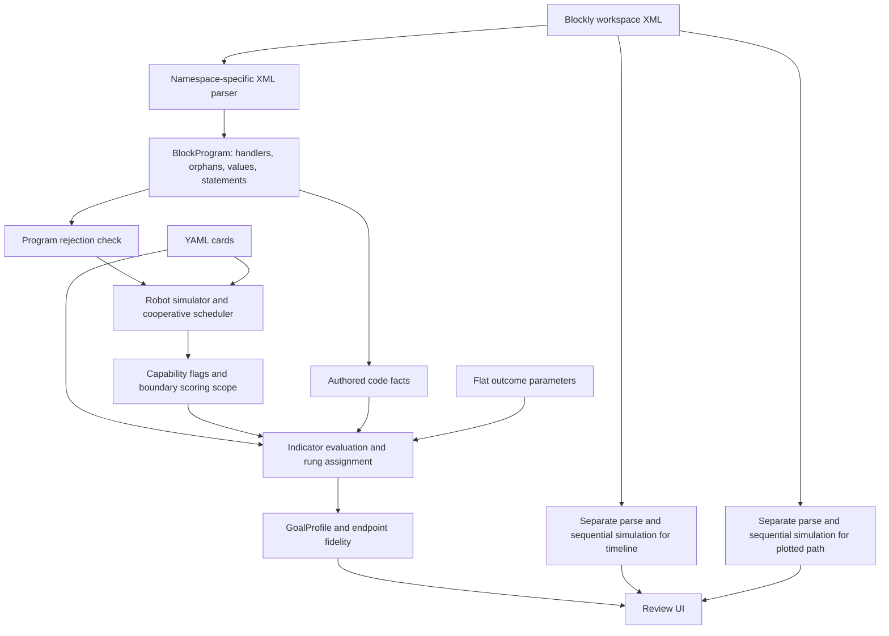

**Repository deep dive - 2026-09-10**

Reviewed checkout: `2ad1770`. This is an engineering assessment, not a new calibration ruling. All behavioral reproductions below use synthetic inputs. Application source, configuration cards, existing tests, frozen fixtures, and the pre-existing integration plan were not changed.

**Assessment**

The repository has a useful, carefully considered evidence model: authored code, simulated behavior, and observed outcomes remain distinguishable; missing evidence can abstain; thresholds have provenance; and simulation changes are supposed to be attributed before acceptance. Its strongest engineering asset is the connection between measurement history and executable examples.

The largest weakness is that this model is implemented inconsistently across consumers. The profile, timeline, visualization, and batch tools independently parse or simulate the same workspace, with different execution settings and different treatment of uncertainty. Several resulting contradictions are reproducible through ordinary API calls. Packaging and input robustness also fall short of the integration plan's assumptions.

I would preserve the evidence model and simulator's measurement record, while consolidating execution and evidence policy before using the package for live student feedback.

**What actually runs**



The public API exports `profile`, `GoalProfile`, `GoalEvidence`, and `Indicator`. Timeline functions are in a separate module. The core dependency is PyYAML; pandas and pyarrow serve offline tools.

The parser constructs linked block sequences and nested bodies, preserves named statement/value slots, and prefers connected blocks over shadow defaults. A top-level stack is live when it starts at a hat (the registry's `event` class, an explicit list) or it is a procedure definition that live code calls; called definitions land in `procedure_stacks`, and `live_stacks` is what every code-channel consumer walks. The simulator registers definition bodies and executes them inline at each call. Disabled blocks are dropped from live stacks at parse time.

The approximately 4,000-line simulator combines an interpreter, a cooperative scheduler, sensor geometry, movement and coverage sampling, tracing, and path analysis helpers. Its cooperative scheduler advances runnable threads to yield points and commits shared drivetrain motion between events. Sensor hats and broadcasts retain documented approximations. The normal world keeps movable objects static and marks stale sensor evidence after disturbance; the scenario battery enables a separate kinematic push model.

`profile()` computes a full simulation, selects the scoring scope at the first boundary exit, optionally applies an outcome-corroborated override, evaluates generic indicators, assigns card-defined rungs, and attaches flags. Its result contains evidence per goal, not a probability distribution over inferred student intentions.

The current goal card contains four goals and eight indicator instances backed by an eleven-function registry. Playground engagement and remaining on the island intentionally have no intent indicators. Plow intent combines authored magnet use with simulated proximity. Plow attainment estimates attachment clearance. Debris intent measures coverage; attainment uses observed weight cleared.

**Confirmed findings, in repair order**

**1. High priority: profile, timeline, and review plot can disagree about the same run.**

Sources: [profile.py:130](src/vex_goal_profiles/profile.py#L130), [timeline.py:82](src/vex_goal_profiles/timeline.py#L82), [data.py:306](viz/data.py#L306).

`profile()` resolves `simulation.scheduler` from the playground card, which selects cooperative execution. `timeline_result()` and `walkthrough_payload()` call `simulate_path()` without that setting; its default is sequential.

Reproduction: two `when_started` stacks issue `drive_for(1000)` and `drive_for(400)`.

| Consumer | Observed result |
|---|---|
| Profile movement | 400 mm |
| Timeline movement event | 1,400 mm |
| Walkthrough summary | 400 mm |
| Walkthrough plotted displacement | 1,400 mm |

The timeline also bypasses the profile's whole-program rejection check. Adding a Switch block makes profile simulation indicators abstain, while the timeline still emits movement and on-island attainment events from neighboring code. Source inspection also shows that the timeline does not implement the profile's outcome override or full flag propagation.

Impact: the review instrument can display an explanation inconsistent with the result being reviewed. This is the first architectural repair to make: a shared execution result should supply profile, timeline, plot, and downstream analysis.

**2. High priority: non-finite telemetry becomes confident achievement.**

Sources: [indicators.py:277](src/vex_goal_profiles/indicators.py#L277), [indicators.py:301](src/vex_goal_profiles/indicators.py#L301), [config.py:43](src/vex_goal_profiles/config.py#L43).

Numeric outcome readers call `float()` but do not reject NaN or infinity. Numeric rung evaluation falls through to the final label when all comparisons with NaN are false.

Observed through `profile()`:

- `weight_cleared = NaN` produces `advanced_goal`, `abstained=False`, and no flags.
- Infinite weight also produces `advanced_goal` without flags.
- NaN GPS produces `robot_moved = moved` and an authoritative `off_island` observation.
- Strict serialization with `json.dumps(asdict(profile), allow_nan=False)` fails.

Impact: bad telemetry can yield both misleading student evidence and invalid JSON for an online consumer. Validate finite numeric values before geometry or rung assignment, and preserve named invalid-input abstentions.

**3. High priority: ordinary numeric expressions can escape the no-crash contract.**

Sources: [simulate_path.py:3485](vendor/goal_strategy_detector/simulation/simulate_path.py#L3485), [parse_blocks.py:123](vendor/goal_strategy_detector/parsing/parse_blocks.py#L123).

Synthetic Blockly expressions connected to a drive amount produced these uncaught exceptions from `profile()`:

| Expression/input | Result |
|---|---|
| Random with an infinite bound | `OverflowError: cannot convert float infinity to integer` |
| Round infinity | Same `OverflowError` |
| Exponential function with input 1000 | `OverflowError: math range error` |
| A linked sequence of about 1,100 blocks | `RecursionError` during parsing |

The simulator's discrete-value sanitizer runs too late for exceptions thrown inside expression evaluation. Its executed-block budget does not protect the recursive parser. The confidential corpus's documented zero-crash result does not establish robustness outside that corpus.

The repair needs explicit policies for invalid expression results and input depth/size. A broad catch that silently assigns zero would repeat the uncertainty problems elsewhere.

**4. High priority: absolute turns bypass cooperative motion arbitration.**

Sources: [simulate_path.py:2580](vendor/goal_strategy_detector/simulation/simulate_path.py#L2580), [simulate_path.py:2604](vendor/goal_strategy_detector/simulation/simulate_path.py#L2604).

Relative turns park on the sequencer and supersede the active drivetrain command. `turn_to_heading` and `turn_to_rotation` directly update heading and time without parking or notifying the sequencer.

Reproduction from the default heading: stack A starts a 1,000 mm drive while stack B turns right by 90 degrees, or turns to absolute heading 90.

| Turn form | Robot displacement | Superseded motions |
|---|---:|---:|
| Relative right 90 | 0 mm | 1 |
| Absolute heading 90 | 1,000 mm | 0 |

These commands reach the same heading but interact differently with concurrent motion. The absolute path effectively rotates the robot before committing the already-active drive. Both forms should participate in the same measured drivetrain policy; any behavior change still needs the repository's attribution process.

**5. High priority: procedure reachability is inconsistent across the pipeline.**

Sources: [codefacts.py:21](src/vex_goal_profiles/codefacts.py#L21), [profile.py:148](src/vex_goal_profiles/profile.py#L148), [testcases.py:119](src/vex_goal_profiles/testcases.py#L119), [simulate_path.py:2703](vendor/goal_strategy_detector/simulation/simulate_path.py#L2703).

The simulator executes a called definition's body. Code facts, the ordinary capability scan, and the battery's sensor census walk event-handler trees without expanding reachable procedure definitions.

Confirmed examples:

- A started stack calls a procedure containing magnet boost. The profile reports magnet intent `absent`, while its execution evidence says the magnet was armed.
- A called procedure contains a distance-sensor condition. `run_battery()` reports `eligible=False` because it misses the sensor.

There is a separate concurrency issue: `_active_procs` is one simulator-wide set. Two independent started stacks calling the same movement procedure produce `procedure_recursion_suppressed`, even though neither call recursively invokes itself. A parked call in one thread is mistaken for recursive entry by another.

Use one definition of executable reachability across consumers, and scope recursion tracking to an actual execution call chain.

**6. High priority for deployment: the installed package cannot load its default cards.**

Sources: [pyproject.toml](pyproject.toml), [config.py:23](src/vex_goal_profiles/config.py#L23).

A normal non-editable install into a temporary environment succeeded. Importing the installed package and calling `profile('', 'wheel-smoke')` then failed:

```text
ConfigError: missing config card:
/tmp/vex-deep-dive-venv/lib/python3.12/configs/playgrounds/castle_crashers.yaml
```

The installed distribution contains no YAML files. The loader assumes a repository-relative layout, and package data only declares the block registry CSV. The existing integration plan correctly identifies this issue, but it remains present in this repository.

Ship the cards inside the package and load them as package resources. Validate an installed wheel from outside the checkout; the pytest `sys.path` bootstrap currently hides this class of problem.

**7. Medium priority: simulation uncertainty is lost before profile delivery.**

Sources: [profile.py:329](src/vex_goal_profiles/profile.py#L329), [simulate_path.py:3644](vendor/goal_strategy_detector/simulation/simulate_path.py#L3644), [rung_review.py:132](viz/rung_review.py#L132).

`SimulationResult` records loop caps and unknown reporters separately from `execution_flags`. The profile propagates execution flags and fabricated motion, but does not consistently expose those other limitations.

Reproductions:

- `repeat 100 { drive 2 mm }` executes 20 iterations, records a loop cap, and reports 40 mm. The profile's simulation intent indicators have empty flags.
- A `text` reporter is accepted by the capability card, but the evaluator records it as unknown and substitutes zero. The profile's approach indicator still has empty flags.
- An invented block under a trusted family prefix, such as `pg_drivetrain_...`, inherits `simulates` and can become an unflagged no-op.

Impact: the flags-empty condition used for high-certainty analysis can admit results based on capped or unevaluated behavior, especially when telemetry is missing. Unknown fallback and execution caps need a consistent, observable interpretation at the public evidence boundary.

**8. Medium priority: zero repetitions execute the body once.**

Source: [simulate_path.py:2890](vendor/goal_strategy_detector/simulation/simulate_path.py#L2890).

`raw_n = int(raw or 1)` treats explicit zero as a missing/default value. Both `repeat 0 { drive 100 mm }` and `repeat 1 { drive 100 mm }` produce 100 mm of movement through `profile()`.

A similar truthiness pattern exists in the velocity setters: explicit zero falls back to 50 percent. That code pattern is visible, but I did not independently establish VEX's zero-velocity semantics in this review. The repeat-zero execution itself was reproduced.

**9. Medium priority: timeline proximity ignores passes between endpoints.**

Sources: [indicators.py:117](src/vex_goal_profiles/indicators.py#L117), [timeline.py:179](src/vex_goal_profiles/timeline.py#L179).

The profile computes continuous minimum distance along segments. The timeline's proximity scanner only checks recorded endpoints.

Using the existing synthetic timeline card, whose beacon lies at x=-2286, a single 3,000 mm westward drive passes directly through the beacon. Profile approach is `reached`, with distance zero. The timeline emits no approach event because both endpoints are outside its rung thresholds.

Merely selecting the correct scheduler will not repair this inconsistency. Event scanners must use the same geometric observations as final scoring. Their event position can still be the containing command's step.

**10. Medium priority: the sensor battery has a narrower contract than the online plan implies.**

Source: [testcases.py:269](src/vex_goal_profiles/testcases.py#L269).

The battery is useful experimental infrastructure, but it is not yet part of `profile()` and does not supply a fourth evidence channel today. It defaults to sequential execution, independently loads cards, omits a parse-failure guard, and misses procedure-only sensor usage.

`run_battery('', 'empty')` raises `AttributeError` on `None.event_handler_stacks`. Its per-check output also has no general carrier for the simulator's execution-fidelity flags. Unknown check rules become failed student checks rather than configuration errors. These are concrete boundaries to address before enabling the planned battery integration.

Preserve the useful existing design: with-pieces versus without-pieces comparisons, late materialization near the sensing construct, prerequisite detection checks, and conditional results for capped progress.

**11. Medium priority: profile output is not byte-stable across processes.**

Source: [profile.py:148](src/vex_goal_profiles/profile.py#L148).

Capability flags are appended while iterating a set of block types. The same input produced these outputs under different `PYTHONHASHSEED` values:

```text
seed 1: ['unmodeled_blocks', 'foreign_playground_block']
seed 2: ['foreign_playground_block', 'unmodeled_blocks']
```

The flag set is semantically identical, but serialized arrays differ. Canonicalization matters for byte comparisons and reproducible payloads. The unused `random` import is not the observed determinism problem: the random reporter deliberately uses a midpoint.

**12. Medium priority: review labels can invent uncertainty absent from the model.**

Source: [data.py:144](viz/data.py#L144).

The stack renderer labels non-trusted hats as forced/unfaithful based on block type rather than the actual modeled/deferred execution decision. A modeled optical detection hat displayed `FORCED` and `trigger_unfaithful` while the profile carried no such flag.

This affects interpretation of the research evidence even when the numerical result is correct. Labels should derive from execution metadata. I verified the generated UI payload; I did not visually validate a live browser session.

**Performance and production boundaries**

The execution budget limits executed statements. It is not a CPU deadline. Per-statement work includes reporter evaluation, sensor marching, object checks, and distance-dependent grid sampling. Parsing and recursive tree walks also happen outside that budget. `time_budget_s` is modeled run duration, not an elapsed CPU timeout.

Synthetic measurements on this machine, using the current cards:

| Program | One-call profile latency |
|---|---:|
| One repeat-20 around a 50 mm drive | 3.1 ms |
| Two nested repeat-20 loops | 30.8 ms |
| Three nested repeat-20 loops | 537.5 ms |

These are individual diagnostic measurements, not population percentiles. They refute the integration plan's claim that the statement budget is effectively a sub-50-ms latency ceiling. The existing performance assertion checks corpus median latency, not p99 or worst case.

For the fixed playground, much of the work is approximately linear in executed trace length. A general input-size analysis must also account for reporter-tree size, geometry sampling, object and sensor counts, and parser depth. The plan's blanket 'no superlinear term' claim is too strong. Measure realistic tails and apply actual elapsed-time limits at the hosting boundary if needed.

The walkthrough runs simulation three times: once for the profile, once for the timeline, and once for the plot. Sharing an execution artifact would remove duplicate work and, more importantly, enforce consistency.

**What is implemented versus specified**

`PIPELINE_DATAFLOW.md` remains a design sketch with partial offline analogues. The integration plan's assertion that config path resolution is the only real code change understates the work required for the described live contract.

| Described behavior | Current implementation |
|---|---|
| Simulation and outcome evidence | Present in `profile()` |
| Configuration provenance | Card-content hash present |
| Program rejection with partial profile | Present for configured rejection blocks |
| Timeline explaining the same scored execution | Separate, inconsistent implementation |
| Early-stop fidelity waiver and outcome modifiers | Described; profile mainly uses stop status to disable boundary override |
| `sim_unverified` confidence downgrade | Described; not emitted by the public profile |
| Debris predicate bracketing | Implemented in the offline fidelity sweep, not the public profile |
| Sensor battery feeding goal attainment | Planned, not wired into `profile()` |
| Rubric dimensions and scoring | Explicit design stub |
| Plain-dict event adapter and telemetry pairing | Proposed in the integration plan |
| Pipeline implementation version in output | Absent; `config_version` hashes cards only |

A synthetic run with roughly 1,915 mm of endpoint error still had empty simulation intent flags. A stopped run retained a normal numeric endpoint error with no early-stop reason. These are demonstrations of the gap between the design sketch and the present API, not evidence that every design item was promised as already shipped.

For event integration, bind telemetry to the correct run across resets, subsequent runs, and multiple outcome events. Reuse simulation by XML plus all execution-affecting configuration and options. Recompute outcome-dependent scoring when telemetry changes. Caching an entire profile solely by code would be incorrect. I reviewed the integration proposal here; I did not inspect the target repository to validate its stated contracts.

**Research interpretation**

The documented 76.6 percent endpoint agreement measures simulator fidelity on telemetry-bearing runs. It is not a measured goal-recognition accuracy or a calibrated probability of student intent. Mechanism-attributed disagreements remain disagreements; explaining one does not make the trajectory accurate.

The repository explicitly records that only about half the population runs have telemetry, that this missingness is related to behavior and collection conditions, and that calibration overlaps part of the validation sample. Those caveats matter when turning per-run evidence into longitudinal claims about learning.

Coverage indicates where a simulated robot traveled. Proximity plus authored magnet use suggests pursuit of a goal. Neither alone establishes a student's mental intention. Keeping evidence channels and goal facets visible is the right foundation for a feedback system; collapsing them into one confident student label would discard the project's most valuable distinctions.

The frozen-path tests are good regression alarms, but identity to a previous implementation is not independent correctness evidence. Synthetic semantic tests, measured VEX probes, and reviewer attribution serve different purposes and should all remain.

**Validation performed and limits**

- Read the core pipeline, parser, scheduler and interpreter, indicators, timeline, battery, loaders, sweeps, visualization assembly, configuration, current design/status documents, and integration plan.
- Installed the package and development/visualization dependencies in a temporary environment. The system Python initially lacked pandas and venv bootstrap support; no system packages were changed.
- Full suite: **206 passed, 7 failed, 38 setup errors, 2 skipped**, 253 tests total. The 45 failing/error cases require absent confidential corpus or frozen-fixture files. One UI-import case also emits a Streamlit session-context exception around its missing-data failure.
- After explicitly deselecting those 45 unavailable-data cases: **206 passed, 2 skipped, 45 deselected**. The two skips require the ungenerated rung CSV. Existing tests were not edited or weakened.
- Ran public-API, installed-package, timeline, simulator, battery, and generated-UI-payload reproductions described above.
- Checked cross-process flag ordering and measured synthetic latency.
- Did not reproduce the confidential population's accuracy, latency distributions, or frozen-path identities; did not run the real VEX runtime or a browser-based pixel review.

There is no tracked CI configuration in this checkout. The suite's checkout path injection makes unit execution convenient but masks packaging failures. A clean-install smoke check and a clearly separated standalone test invocation would materially improve collaborator onboarding.

**Recommended repair sequence**

1. Introduce one internal execution artifact containing the parsed program, full trace, scored scope, execution settings, and uncertainty metadata. Make profile, timeline, and visualization consume it. Keep this a small internal refactor, not a new framework.
2. Correct non-finite outcome handling and exception/depth boundaries; add end-to-end synthetic contract cases for these inputs.
3. Repair absolute-turn scheduling and procedure reachability/call-stack ownership. Attribute behavior changes on the private corpus before accepting changed fixtures.
4. Make all modeled limitations visible at the evidence boundary, and make timeline geometry and UI labels agree with that evidence.
5. Package the cards and verify the built wheel outside the checkout. Define versioned, strictly JSON-safe serialization and the event-pairing contract.
6. Validate realistic tail latency and cross-process reproducibility. Keep rubric scoring and battery expansion in their documented later phases.

The existing measurement ledger is worth preserving. The most effective next work is to make all consumers faithfully share the execution and uncertainty decisions it records.
